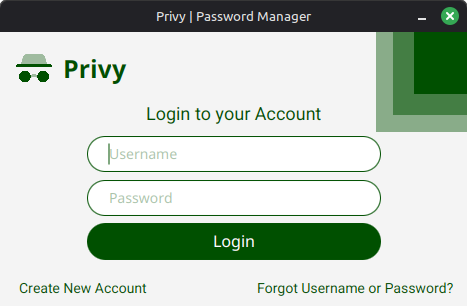

# Privy | Password Manager

An Offline Password Manager solution for privacy geeks out there 😎

# Preview

# Under Development

Coming soon!

# Update Logs

- Feb. 23, 2026
   - Successfully connected the database (sqlite) and implemented the login function.
- Feb. 24, 2026
   - Refactor the code for the user login to populate the tableview in the Dashboard.
   - Designed the dashboard so it will be responsive in full screen.
- Feb. 28, 2026
   - Added the function to show the password details in the textfields upon clicking on the table (list of passwords).
   - Design the first iteration of the *Create Account form*.
- March 01, 2026
   - Added the security questions (static database) to the Create Account form (UI).
- March 05, 2026
   - *Create new account form* is complete and working:
      - Added a feature to Hash the password using *PBKDF2*.
      - Added a validation to check if email format is valid using *Java Regex*.
   - Updated the login function so it will accept the Hash Password.
- March 06, 2026
   - Added a show and hide password feature in Create Account form.
   - Added an additional error handler to ensure user typed a minimum of 8 character password.
   - Added a Navigation class to control the switching scene.
- March 07, 2026
   - Design the form for Reset Password:
      - Verification requires:
         - Recovery email and Security Question - status: *working*.
         - Verfiy Answer function - status: *work in progress*.
         - Reset Password function - status: *work in progress*.
- March 08, 2026
   - For Reset Password form:
      - Verfiy Answer function - status: *working*.
      - Reset Password function - status: *work in progress*.
- March 09, 2026
   - For Reset Password form:
      - Reset Password function - status: *working*.
   - All forms have *Show and Hide password* features.